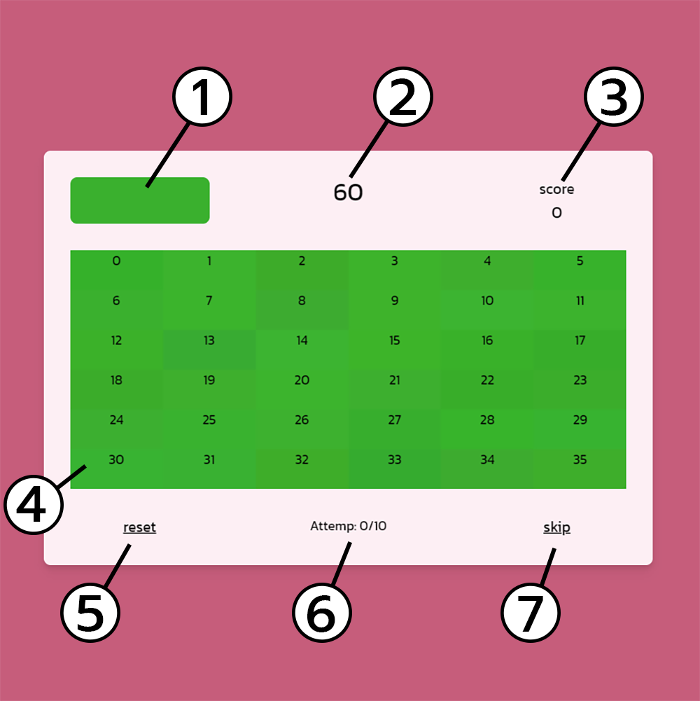

## About Golden Eyes Game

_GoldenEyesGame_ - agame project made from NextJS with simple rules. Finding the color in the table that match the given color.

In this project, I created a game from NextJS and Tailwind. The rule is find the colors within the table that have many similar colors, but only one color matches the given color. I have deployed this game to vercel, you can try it [Here!](https://golden-eyes-game.vercel.app).

## Youtube

For more information can be seen in my [video](https://youtu.be/CPrN-oZEM08) on YouTube.

[]("https://youtu.be/CPrN-oZEM08")

## Requirements

- NodeJS
- Git

## Install

```
git clone https://github.com/TitorPs360/golden-eyes-game
cd golden-eyes-game
yarn
```

## Usage

- Run game on localhost

  - ```
    yarn dev
    ```

  - Open [http://localhost:3000](http://localhost:3000) with your browser to see the result.

- Build static game

  - ```
    yarn build
    yarn export
    ```

- Deploy on Vercel

  The easiest way to deploy your Next.js app is to use the [Vercel Platform](https://vercel.com/new?utm_medium=default-template&filter=next.js&utm_source=create-next-app&utm_campaign=create-next-app-readme) from the creators of Next.js.

  Check out our [Next.js deployment documentation](https://nextjs.org/docs/deployment) for more details.

## Basic rules of play

1. Find the color in the table that is the same as the color in the upper left corner. (Find the color in the table that is the same as the color in the upper left corner. (There is only one that correct)
2. Each table can be attempts up to 10 times. When depleted, the table will change.
3. There is a time to play each round 60 seconds.
4. When you answer correctly, you gain additional 10 seconds.
5. Have fun playing the game.

## Basic components in game

[]

1. The color we need to find
2. Remaining time
3. Score
4. Answer table
5. Restart game
6. The number that can be pressed again in that table
7. Skip to next table
